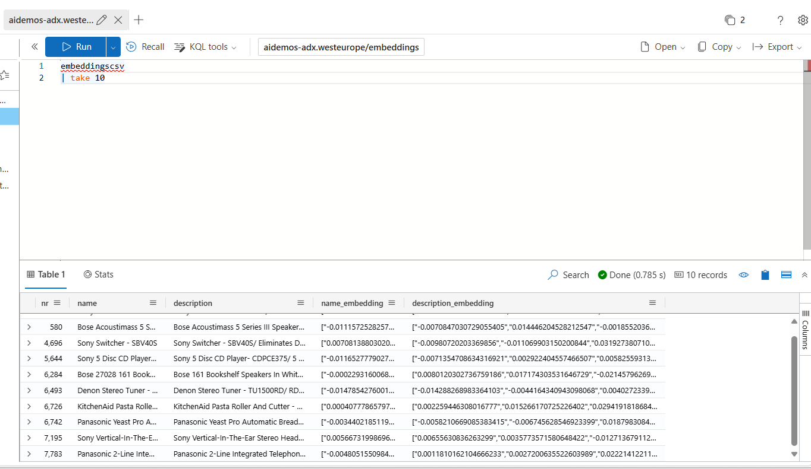

In this Lab we will develop a RAG application using Azure Data Explorer as our Vector DB.
Retrieval Augmented Generation (RAG) is an architecture that augments the capabilities of a Large Language Model (LLM) like ChatGPT by adding an information retrieval system that provides grounding data. Adding an information retrieval system gives you control over grounding data used by an LLM when it formulates a response. For an enterprise solution, RAG architecture means that you can constrain generative AI to your enterprise content sourced from vectorized documents and images, and other data formats if you have embedding models for that content.


# Requirements
- An Azure Data Explorer Cluster 
- An Azure Data Explorer Database

# Preparation

## Azure Data Explorer
Create an Azure Data Explorer cluster.
Create a Database called "embeddings"

## Environment variables
Make sure you fill all the settings in your .env file as follows:
```
OPENAI_GPT4_DEPLOYMENT_NAME="gpt-4"
OPENAI_ADA_EMBEDDING_DEPLOYMENT_NAME="text-embedding-ada-002"
OPENAI_DEPLOYMENT_ENDPOINT="<your azure openai deployment url>" 
OPENAI_API_KEY="<the key to the azure open ai service>"

# Azure Data Explorer (ADX) details
AAD_TENANT_ID = "<your AAD tenant ID>"
KUSTO_CLUSTER =  "<your ADX cluster URL>"
KUSTO_DATABASE = "embeddings"
KUSTO_TABLE = "books"
KUSTO_MANAGED_IDENTITY_APP_ID = "<Managed identity app used to access ADX>"
KUSTO_MANAGED_IDENTITY_SECRET = "<Managed identity app secret ID>"
 ```
## Install all the libraries in the requirements.txt file

## Create and ingest the embeddings into the Vector DB (Azure Data Explorer)


The first step to create a RAG pattern is the generation of the embeddings for the content. 
In order to do that you need to run the notebook [RAG - Azure Data Explorer - create embeddings](./RAG%20-%20Azure%20Data%20Explorer%20-%20create%20embeddings.ipynb).  
YOU SHOULD RUN THIS NOTEBOOK ONLY ONCE.  

After running the notebook you should have more than 1K entries in the embeddingscsv table as follows


## Test the vector search

Run the [RAG - Azure Data Explorer - search your data](./RAG%20-%20Azure%20Data%20Explorer%20-%20search%20your%20data.ipynb) notebook


